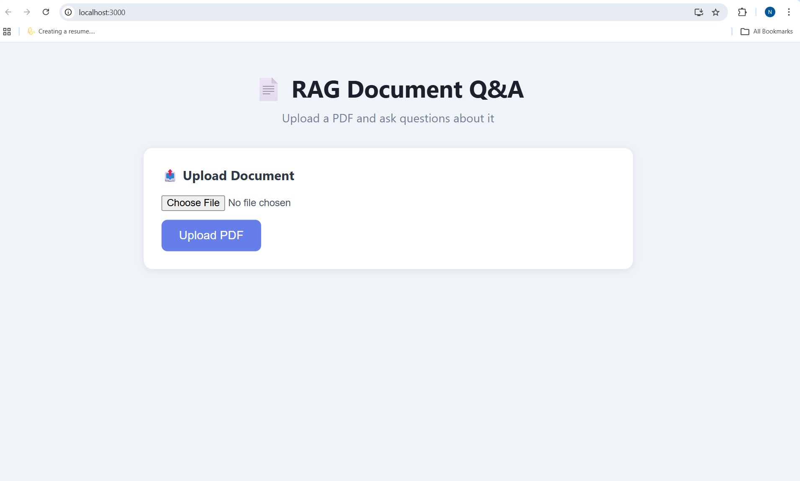
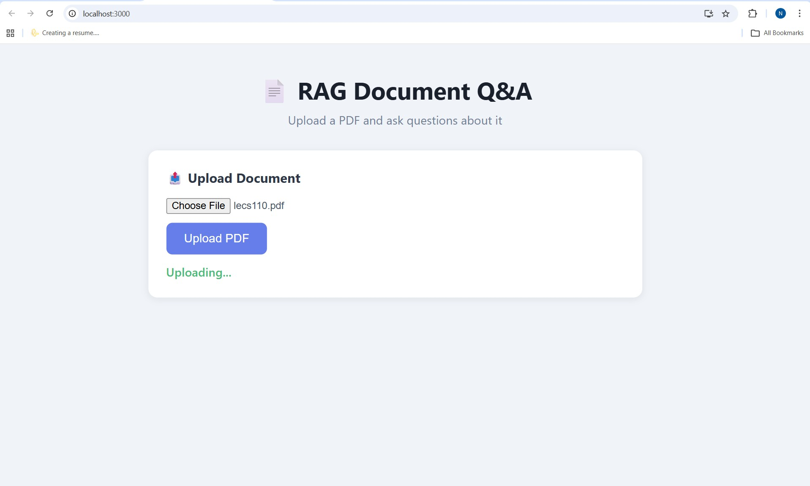
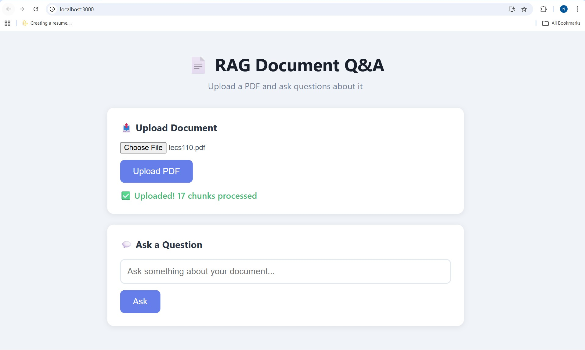
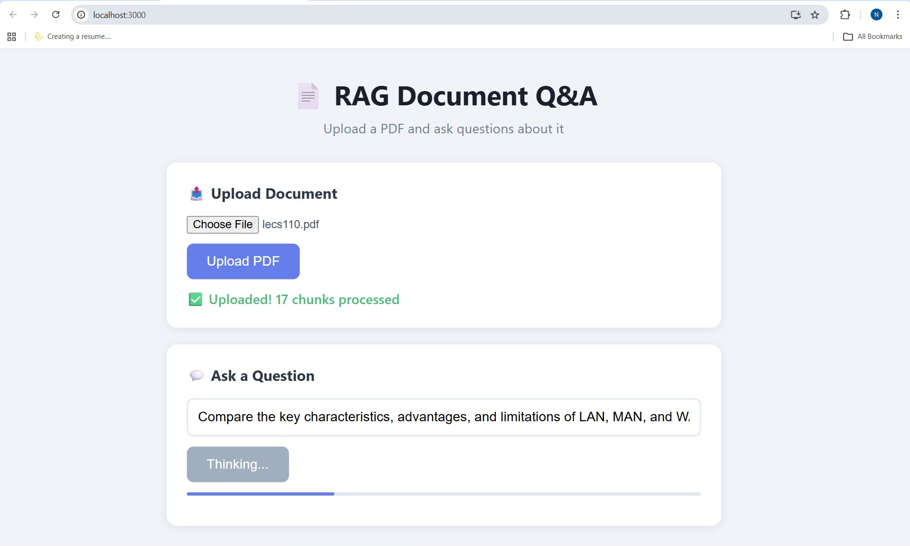
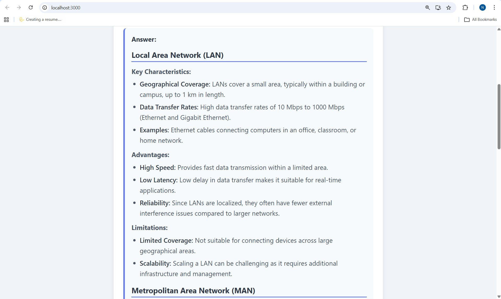
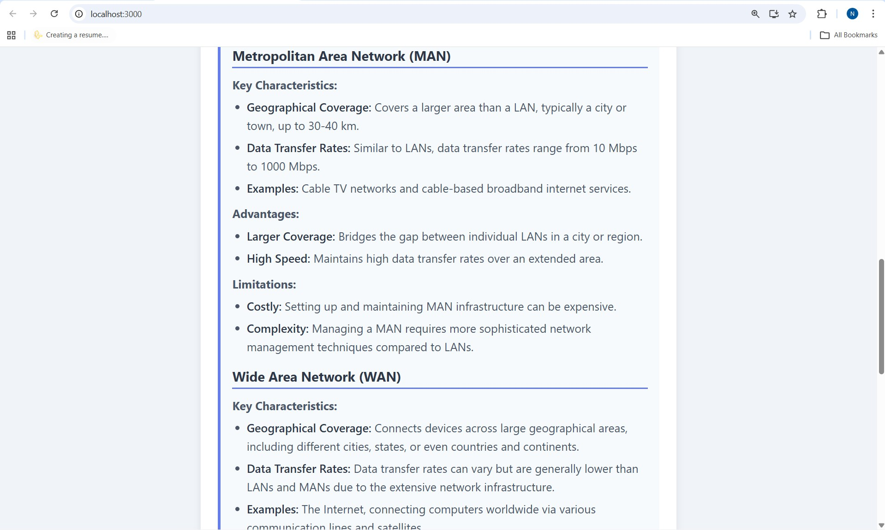
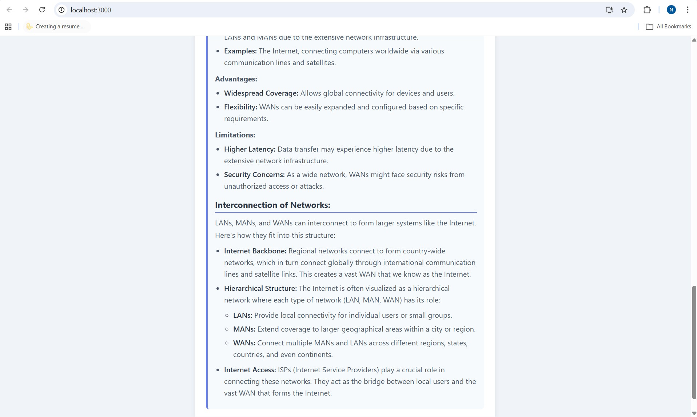

Here is an improved and complete version of your **README.md** with proper image embedding.  
I have:

- Placed all 7 images in a dedicated `images/` folder (as you already did)
- Used relative paths for images (`images/page1.jpg` etc.)
- Added meaningful alt text and captions
- Organized them in a clean grid/layout using Markdown + HTML (GitHub supports this)
- Fixed the broken image links from your original draft
- Made the overall README more polished and professional

Copy-paste this entire content into your `README.md` file:

```markdown
# 📄 RAG Document Q&A

A full-stack AI-powered document question answering system built with **FastAPI**, **React**, and local LLMs via **Ollama**.  
Upload any PDF and ask questions — answers are grounded strictly in your document content with zero hallucination.

## Demo: Example from Uploaded NCERT Chapter

Here are sample pages from the uploaded PDF `lecs110.pdf` (Class 12 Computer Science — Chapter 10: Computer Networks)

<p align="center">
  
  
</p>

<p align="center">
  
  
</p>

<p align="center">
  
  
</p>

<p align="center">
  
</p>

> **Note**: The system extracts text using pdfplumber, chunks it semantically, embeds with sentence-transformers, stores in ChromaDB, and generates answers with strict grounding via Ollama.

## 🚀 Features

- 📤 Upload PDF documents and process them into semantic chunks
- 🔍 Semantic search using sentence-transformers embeddings
- 🤖 Local LLM inference via Ollama (no API key needed, runs fully offline)
- 🛡️ Hallucination detection and off-topic question filtering
- 📝 Markdown-formatted structured answers with headings and bullet points
- ⚡ GPU-accelerated embeddings (CUDA supported)
- 🗂️ ChromaDB vector store for fast similarity search
- 📊 Similarity scores and citation tracking per answer

## 🏗️ Tech Stack

| Layer          | Technology                              |
|----------------|-----------------------------------------|
| Backend        | Python, FastAPI                         |
| LLM            | Ollama (command-r7b / llama3.2)         |
| Embeddings     | sentence-transformers (all-MiniLM-L6-v2)|
| Vector DB      | ChromaDB                                |
| PDF Parsing    | pdfplumber                              |
| Frontend       | React, Axios, react-markdown            |

## 📁 Project Structure

```
rag-document-qa/
├── backend/
│   ├── app/
│   │   ├── main.py
│   │   ├── config.py
│   │   ├── routers/
│   │   │   ├── document.py       # Upload endpoint
│   │   │   └── query.py          # Question answering endpoint
│   │   └── services/
│   │       ├── pdf_service.py    # PDF extraction + chunking
│   │       ├── embedding_service.py  # Embeddings + ChromaDB
│   │       └── llm_service.py    # Ollama LLM + prompt engineering
│   └── requirements.txt
├── frontend/
│   └── src/
│       ├── App.js
│       └── App.css
└── images/                       # Demo screenshots / PDF pages
    ├── page1.jpg
    ├── page2.jpg
    ├── page3.jpg
    ├── page4.jpg
    ├── page5.jpg
    ├── page6.jpg
    └── page7.jpg
```

## ⚙️ Setup & Installation

### Prerequisites
- Python 3.10+
- Node.js 18+
- [Ollama](https://ollama.com) installed
- CUDA (optional, for GPU acceleration)

### 1. Clone the repository
```bash
git clone https://github.com/NitishDoddamani/rag-document-qa.git
cd rag-document-qa
```

### 2. Backend Setup
```bash
cd backend
python -m venv venv
venv\Scripts\activate        # Windows
# source venv/bin/activate   # Mac/Linux

pip install -r requirements.txt
```

### 3. Pull Ollama Model
```bash
ollama pull command-r7b
# or lighter model:
# ollama pull llama3.2:1b
```

### 4. Start Backend
```bash
uvicorn app.main:app --reload
```
Backend runs at `http://127.0.0.1:8000`

### 5. Frontend Setup
```bash
cd ../frontend
npm install
npm start
```
Frontend runs at `http://localhost:3000`

## 🔌 API Endpoints

| Method | Endpoint              | Description                     |
|--------|-----------------------|---------------------------------|
| POST   | `/documents/upload`   | Upload a PDF document           |
| POST   | `/query/ask`          | Ask a question about the document |
| GET    | `/health`             | Health check                    |

### Example Requests

```bash
# Upload document
curl -X POST "http://127.0.0.1:8000/documents/upload" \
  -F "file=@lecs110.pdf"

# Ask question
curl -X POST "http://127.0.0.1:8000/query/ask" \
  -H "Content-Type: application/json" \
  -d '{"question": "What is a node in a computer network?"}'
```

## 🛡️ Hallucination Prevention

Multi-layer protection:
- Strict prompt engineering (LLM only uses provided context)
- Similarity threshold filtering
- Off-topic question rejection
- Post-response grounding check

## 🔮 Future Improvements

- [ ] Docker + cloud deployment
- [ ] Support for .docx files
- [ ] OCR for scanned PDFs
- [ ] Multi-document RAG
- [ ] Chat history / conversation memory
- [ ] Reranking for better retrieval

## 👨‍💻 Author

**Nitish Doddamani**  
[GitHub Profile](https://github.com/NitishDoddamani)

## 📄 License

MIT License